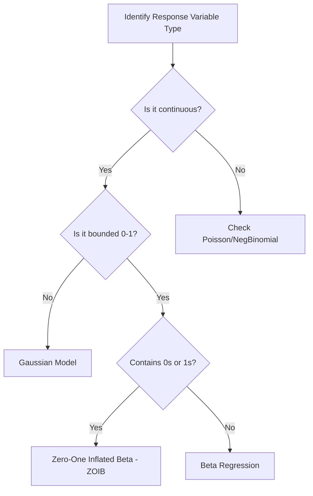

# Bayesian Analysis

This skill guides robust Bayesian workflows for marine ecology, focusing on prior selection, model fitting with `brms`, convergence diagnostics, and model comparison via LOO-CV.

## When to use this skill

- Use this when fitting models to complex ecological datasets with hierarchical structures.
- Use this when you need to specify informative or weakly-informative priors based on biological knowledge.
- Use this for proportional data (0-1) where zero-inflation or one-inflation is expected (ZOIB).
- Use this to compare multiple candidate models using Leave-One-Out Cross-Validation (LOO-CV).

## How to use it

### Step 1: Data Preparation
Scale continuous predictors and verify data integrity. Check for zero-inflation in proportional data.

### Step 2: Prior Specification
Use weakly informative priors by default or informative priors when justified.
```r
priors <- c(
  prior(normal(0, 1.5), class = "b"),
  prior(normal(0, 2.5), class = "Intercept"),
  prior(exponential(1), class = "sd")
)
```

### Step 3: Model Fitting
```r
model <- brm(
  formula = response ~ predictor1 + predictor2 + (1 | site),
  data = data_scaled,
  family = gaussian(),  # or zero_one_inflated_beta()
  prior = priors,
  backend = "cmdstanr",
  cores = 4, chains = 4, iter = 4000
)
```

### Step 4: Convergence Diagnostics
Check **R-hat < 1.01** and **ESS > 400**. Inspect trace plots.

### Step 5: Model Comparison (LOO-CV)
```r
loo_compare(loo(model1), loo(model2))
```

## Decision tree for model selection



## Common pitfalls

1. **Divergent transitions**: Increase `adapt_delta` to 0.99.
2. **Singular fit**: Simplify random effect structure if variance is near zero.
3. **High R-hat**: Increase iterations or check for multimodality.
4. **PSIS warnings**: Investigate outliers with high Pareto k values.
