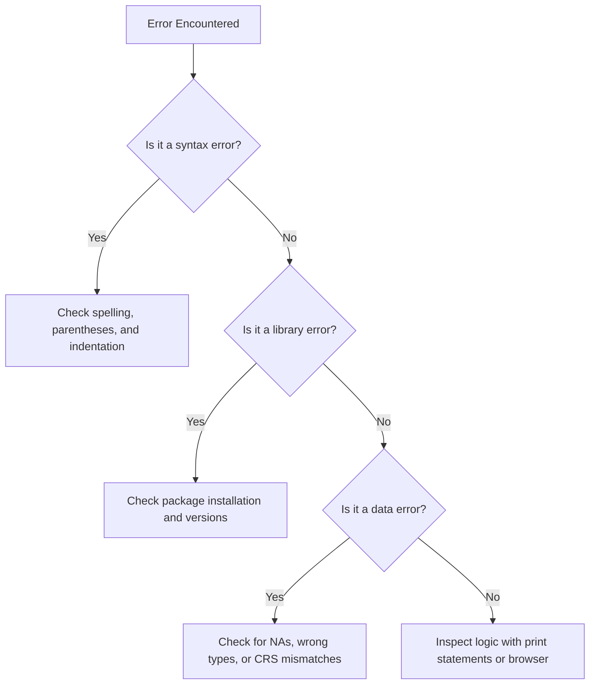

# Code Debugging & Review

This skill guides systematic debugging and code review for R/Python scripts, with a focus on common error patterns in marine ecology workflows (e.g., CRS mismatches, NA handling, convergent transitions).

## When to use this skill

- Use this whenever an error message is encountered during script execution.
- Use this to perform a systematic code review before finalizing a production script.
- Use this when code produces unexpected results without explicit errors.
- Use this to generate a minimal reproducible example (MRE) for external debugging.

## How to use it

### Step 1: Error Pattern Recognition
Consult the quick-lookup table for common error types (e.g., `object not found`, `subscript out of bounds`) to identify likely causes.

### Step 2: Traceback Analysis
Use `traceback()` in R or `traceback.print_exc()` in Python to locate the exact failing line.

### Step 3: Isolation with MRE
Extract the failing logic and create a minimal script with small, synthetic data that reproduces the exact error.

### Step 4: Systemic Fix & Verification
Apply the fix to the MRE first, then transfer to the original script. Verify that the fix doesn't introduce side effects.

### Step 5: Code Review Checklist
Validate the code against standards for:
- Data quality (CRS, NA handling)
- Reproducibility (seeds, relative paths)
- Performance (avoiding `rbind` in loops)
- Style (documentation, modularity)

## Decision tree for error resolution

## Common pitfalls

1. **Ignoring warnings**: Warnings often predict future errors; treat them as issues to resolve.
2. **Fixing symptoms**: Always address the root cause rather than patching the immediate error.
3. **Not testing the fix**: Verify that the solution works and doesn't break other modules.
4. **Silent failures**: Ensure critical operations are wrapped in error logging, not swallowed.
