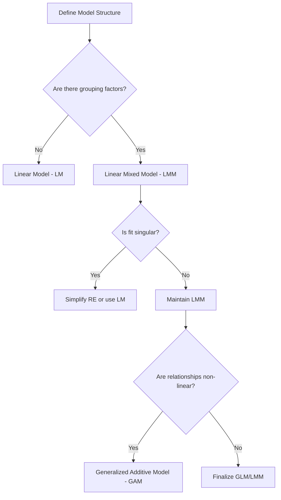

# GLM/GAM Modeling

This skill guides Generalized Linear and Additive Modeling (GLM/GAM) workflows, emphasizing proper diagnostics, model selection via Type II ANOVA, and the effective handling of random effects.

## When to use this skill

- Use this when fitting linear or additive models to ecological data.
- Use this to decide between a simple Linear Model (LM) and a Linear Mixed-Effects Model (LMM).
- Use this when incorporating smooth terms (splines) into models using `mgcv`.
- Use this to assess the relative importance of predictors using Type II ANOVA.

## How to use it

### Step 1: Data Preparation
Scale continuous predictors and explicitly set factor levels. Check for zero-variance predictors that could cause model instability.

### Step 2: Model Type Selection
Evaluate whether a random effect (e.g., SITE) is justified. Fall back to LM if the LMM fit is singular.

### Step 3: Type II ANOVA
Use `car::Anova(model, type = "II")` for a balanced interpretation of main effects, especially in unbalanced designs.

### Step 4: GAM-Specific Diagnostics
For GAMs, check for concurvity (values > 0.8 indicate issues) and ensure effective degrees of freedom (edf) are well within the basis dimension (k).

### Step 5: Reporting
Report R² (marginal/adjusted) and relative importance based on Sum of Squares.

## Decision tree for model selection

## Common pitfalls

1. **Singular fit warning**: Indicates random effect variance is near zero; consider removing the random effect.
2. **Type I vs Type II ANOVA**: Always prefer Type II for ecological datasets which are rarely perfectly balanced.
3. **Over-smoothing in GAMs**: Check `gam.check()`; if edf is too close to k, increase k or simplify.
4. **Ignoring concurvity**: High concurvity in GAMs can hide significant relationships and inflate standard errors.
