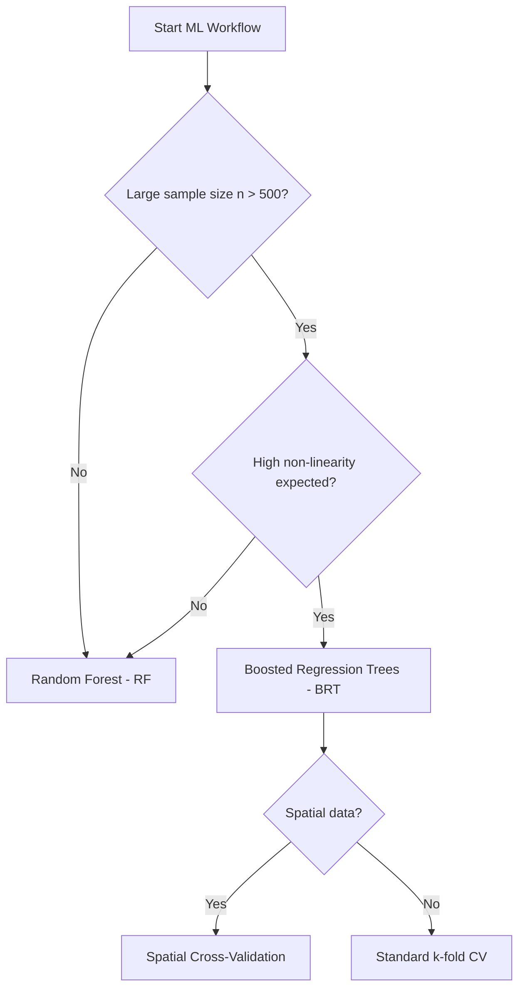

# Machine Learning & SDM

This skill guides tree-based modeling (BRT, Random Forest, GBM) workflows, emphasizing proper hyperparameter tuning, uncertainty quantification via TRUE REFIT bootstrap, and spatial cross-validation for species distribution models (SDMs).

## When to use this skill

- Use this when building Species Distribution Models (SDMs) using tree-based algorithms.
- Use this to perform rigorous VIF analysis to remove collinear predictors before modeling.
- Use this when you need to quantify prediction uncertainty using the TRUE REFIT bootstrap method.
- Use this for hyperparameter optimization via automated grid search.

## How to use it

### Step 1: VIF Analysis
Perform iterative Variance Inflation Factor (VIF) analysis to identify and remove redundant predictors (threshold > 10).

### Step 2: Grid Search
Execute an automated grid search to find the optimal combination of Tree Complexity (tc), Learning Rate (lr), and Bag Fraction (bf).

### Step 3: Model Performance
Use Cross-Validation (CV) Explained Deviance as the primary performance metric for Gaussian and non-Gaussian distributions.

### Step 4: TRUE REFIT Bootstrap
Quantify uncertainty for Partial Dependence Plots (PDPs) by refitting the entire model on multiple bootstrap samples using the same hyperparameters.

### Step 5: Variable Importance
Rank predictors based on their relative influence (%) and analyze interaction strengths between top variables.

## Decision tree for model selection

## Common pitfalls

1. **Formula not preserved**: Always use `do.call(gbm::gbm, ...)` in R to ensure the model object preserves the formula for future predictions.
2. **Wrong performance metric**: Never rely on training R²; always use CV Explained Deviance or similar out-of-bag metrics.
3. **Residual bootstrap**: This underestimates uncertainty by not accounting for the stochastic nature of the fitting process. Always use TRUE REFIT.
4. **Ignoring spatial structure**: Standard cross-validation overestimates performance for geographic data due to spatial autocorrelation. Use spatial blocking.
