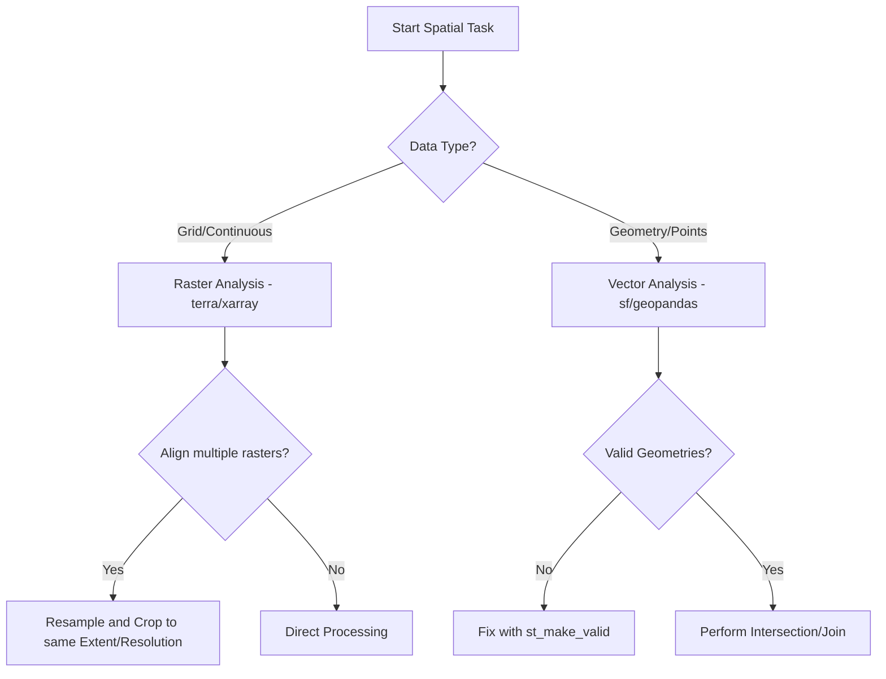

# Spatial Ecology Core

This skill guides fundamental spatial data manipulation (rasters and vectors) using R (`terra`, `sf`) and Python (`rasterio`, `geopandas`, `xarray`). It emphasizes absolute rigor in Coordinate Reference System (CRS) handling and memory-efficient processing of large-scale marine datasets.

## When to use this skill

- Use this for any operation involving spatial data (GeoTIFF, NetCDF, Shapefile, GeoJSON).
- Use this to reproject datasets to a common CRS (typically WGS84 or UTM).
- Use this when performing raster-vector intersections (e.g., extracting values at point locations).
- Use this to identify and correct spatial autocorrelation in ecological models.

## How to use it

### Step 1: CRS Verification & Transformation
Always verify the CRS of all inputs. Transform all vector and raster data to a single target CRS before any geometric operation.

```r
library(terra)
library(sf)

# CRITICAL: Always check CRS before any spatial operation
verify_and_set_crs <- function(spatial_obj, target_crs = "EPSG:4326") {
  current_crs <- crs(spatial_obj)
  
  if (is.na(current_crs) || current_crs == "") {
    warning("No CRS detected. Setting to WGS84 (EPSG:4326)")
    crs(spatial_obj) <- target_crs
  } else if (current_crs != target_crs) {
    message(paste("Reprojecting from", current_crs, "to", target_crs))
    spatial_obj <- project(spatial_obj, target_crs)
  }
  
  return(spatial_obj)
}
```

### Step 2: Raster Processing
Use the `terra` package (R) or `xarray` (Python) for memory-efficient raster operations like cropping, masking, and resampling.

### Step 3: Vector Operations
Handle spatial features using `sf` (R) or `geopandas` (Python), ensuring valid geometries before performing intersections or joins.

### Step 4: Time-Series Extraction
Extract temporal snapshots or full profiles from raster stacks at specific point or polygon coordinates.

### Step 5: Spatial Autocorrelation Check
Verify the independence of residuals using Moran's I or Variograms to ensure model validity.

## Decision tree for spatial operations



## Common pitfalls

1. **Using deprecated packages**: Avoid the `raster` and `sp` packages in R; always use `terra` and `sf`.
2. **Implicit reprojection**: Never assume the software will handle CRS mismatches automatically during intersections.
3. **Empty extractions**: Always check that vector points overlap with the raster extent before extraction.
4. **Ignoring Autocorrelation**: Failure to check for spatial structure in residuals results in inflated significance (p-values).
