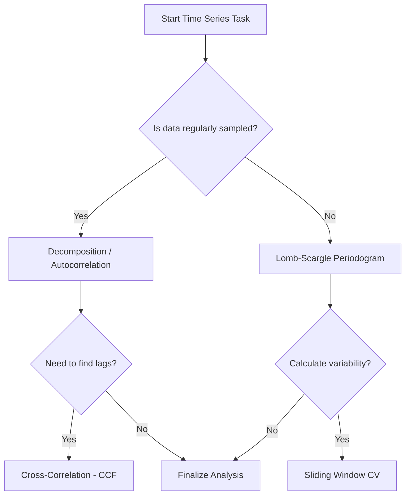

# Time Series Analysis

This skill guides advanced temporal data analysis, specifically tailored for marine ecology datasets that may include irregular sampling frequencies, seasonal cycles, and lagged environmental relationships.

## When to use this skill

- Use this for decomposing time series into trend, seasonal, and residual components.
- Use this when analyzing irregularly sampled data using the Lomb-Scargle periodogram.
- Use this to calculate temporal variability using sliding-window coefficients of variation (CV).
- Use this to identify lagged relationships between environmental predictors (e.g., SST and Chlorophyll).

## How to use it

### Step 1: Data Diagnostics
Check for stationarity, missing values (especially irregular gaps), and calculate basic temporal statistics.

### Step 2: Harmonic Analysis (Lomb-Scargle)
For irregularly sampled data, use the Lomb-Scargle periodogram to identify significant periodicities and filter dominant seasonal frequencies.

### Step 3: Sliding Window CV
Calculate the Coefficient of Variation (CV) across a sliding temporal window (e.g., 2, 30, or 365 days) and average the results over the entire series.

### Step 4: Cross-Correlation & Lags
Identify the time lag at which two variables (e.g., Temperature and DLI) exhibit the strongest correlation using the `ccf` function.

### Step 5: Autocorrelation Check
Verify that residuals from time-series models are not autocorrelated (Ljung-Box test), ensuring model assumptions are met.

## Decision tree for temporal analysis

## Common pitfalls

1. **Incorrect window size**: A sliding window that is too small leads to excessive noise; one that is too large masks temporal signals.
2. **Ignoring non-stationarity**: Failing to detrend a series can lead to spurious correlations between unrelated variables.
3. **Misinterpreting lags**: A significant lag at 6 or 12 months often reflects seasonal coupling rather than direct causal effects.
4. **Spectral leakage**: In spectral analysis, ensure appropriate frequency ranges are tested to avoid aliasing or leakage artifacts.
